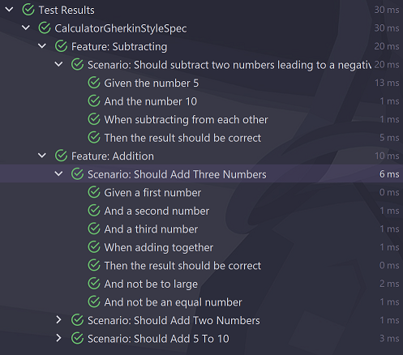

# Arete


[](https://search.maven.org/search?q=g:%22io.github.mictaege%22%20AND%20a:%22arete%22)
[](https://central.sonatype.com/artifact/org.junit.jupiter/junit-jupiter/5.10.2)
[](http://www.apache.org/licenses/LICENSE-2.0.html)

Arete is a lightweight JUnit 5 extension that enables a BDD testing style by describing test cases as specifications and scenarios.



See [arete-gradle](http://github.com/mictaege/arete-gradle) for the Arete Gradle reporting plugin.

## Overview

### Gerkhin style

```Java
@Spec class CalculatorGherkinStyleSpec {

    private Calculator calculator;

    @BeforeEach
    void context() {
        calculator = new Calculator();
    }

    @Scenario class ShouldAddFiveToTen {
        int a, b, c;

        @Given void fiveAndTen() {
            a = 5;
            b = 10;
        }

        @When void addingTogether() {
            c = calculator.add(a, b);
        }

        @Then void theResultShouldBeCorrect() {
            assertThat(c, is(15));
        }
    }
}
```
A specification written in Gerkhin style contains one or more scenarios as nested classes. Each scenario defines several executable steps.

See [arete tests](/src/test/java/com/github/mictaege/arete) for more examples.

### Descriptive Style

```Java
@Spec class CalculatorDescriptiveStyleSpec {

    @Describe class ACalculator {
        private Calculator calculator = new Calculator();

        @ItShould void subtract5From10() {
            assertThat(calculator.subtract(10, 5), is(5));
        }
    }
}
```
A specification written in descriptive style contains one or more descriptions as nested classes. Each description defines several executable expectations.

See [arete tests](/src/test/java/com/github/mictaege/arete) for more examples.

## Lifecycle and Scope

In Gerkhin style each scenario is a single test instance (`@TestInstance(PER_CLASS)`), and all steps are sharing the same test instance and it's state. In this way, one step can access the results of another step. But this also means that the order in which the steps are being executed is important.

In descriptive style a description is always a new test instance (`@TestInstance(PER_METHOD)`), and all expectations has there own exclusive test instance. In this way, every expectation is independent and does not rely on the execution order. But this also means that, one expectation can not access the results of another expectation.

## Execution Order in Gerkhin Style

### Default Order of Given-When-Then Sequences

```Java
@Scenario class ShouldAddFiveToTen {
    int a, b, c;

    @Given void fiveAndTen() {
        a = 5;
        b = 10;
    }

    @When void addingTogether() {
        c = calculator.add(a, b);
    }

    @Then void theResultShouldBeCorrect() {
        assertThat(c, is(15));
    }
}
```
In a simple _Scenario_ the Given-When-Then sequences are automatically ordered, so that the _Given_ sequence is always executed first, followed by the _When_ sequence, and the _Then_ sequence at last. This would even be the case if the order in the source code is different.

### Ordering within a Sequence

```Java
@Scenario class ShouldAddFiveToTen {
    int a, b, c;
    @Given(1) void five() {
        a = 5;
    }
    @Given(2) void ten() {
        b = a * 2;
    }

    @When void addingTogether() {
        c = calculator.add(a, b);
    }

    @Then(1) void theResultShouldBeCorrect() {
        assertThat(c, is(15));
    }

    @Then(2) void notBeAnEqualNumber() {
        assertThat(c % 2, is(1));
    }
}
```
When a _Given_, _When_ or _Then_ sequence consists of more than one step, the inner ordering within the sequence has to be defined using the `step` attribute of the annotation, respectively it's short-form `value`.

### Ordering across Consecutive Sequences

```Java
@Scenario class ShouldAddThreeToTheResultOfFiveAndTen {
    int a, b, c, d;
    @Given void fivAndTen() {
        a = 5;
        b = 10;
    }
    
    @When(seq = 1) void addingFiveToTen() {
        c = calculator.add(a, b);
    }
    
    @Then(seq = 1) void theResultShouldBeCorrect() {
        assertThat(c, is(15));
    }
    @When(seq = 2) void addingThree() {
        d = calculator.add(c, 3);
    }
    @Then(seq = 2, step = 1) void theFinalResultShouldBeCorrect() {
        assertThat(d, is(18));
    }
    @Then(seq = 2, step = 2) void beAnEqualNumber() {
        assertThat(d % 2, is(0));
    }
}
```
If a specification consists of several consecutive Given-When-Then sequences, the sequence and/or the inner order within the sequence could be defined using the `seq` and/or `step` attribute.

## Display Name Generation

Per default Arete uses a display name generation strategy that expects class and method names written in _camelCase_ or tokens separated by _under_scores_.

Example:

```Java
@Scenario class ShouldAddFiveToTen {    
    @Given(1) void five() {...}
    @Given(2) void ten() {...}

    @When void adding_together() {...}

    @Then(1) void theResultShouldBeCorrect() {...}
    @Then(2) void not_be_an_equal_number() {...}
}
```
will result in

```
Scenario: Should Add Five To Ten
    Given five
    And ten
    When adding together
    Then the result should be correct
    And not be an equal number
```
It can happen that the result may not always be optimal. In this case the display name could be explicitly defined using the `desc` attribute of the Arete annotations.

```Java
@Scenario(desc = "Scenario: Should add 5 to 10")
class ShouldAddFiveToTen {
    ...
}
```

## Nesting and Grouping

### Gherkin Style

```Java
@Spec class CalculatorSpec {
    
    @Feature class Addition {
    
        @Scenario class ShouldAddFiveToTen {
            @Given void fiveAndTen() {...}

            @When void addingTogether() {...}

            @Then void theResultShouldBeCorrect() {...}
        }
    
        @Scenario class ShouldAddFiveToTen {
            @Given void minusFiveAndTen() {...}

            @When void addingTogether() {...}

            @Then void theResultShouldBeCorrect() {...}
        }
        
    }
    
    @Feature class Subtraction {
        
        @Scenario class ShouldSubtractTwoNumbers {
            @Given void fiveAndTen() {...}

            @When void subtractingFromEachOther() {...}

            @Then void theResultShouldBeCorrect() {...}
        }
    }
}
```
In Gherkin style scenarios related to a common functionality can be grouped into different nested features using the `@Feature` annotation.

### Descriptive Style

```Java
@Spec class CalculatorSpec {

    @Describe() class ACalculator {
        
        @Describe() class Subtraction {
            
            @ItShould void subtract5From10() {...}

            @ItShould void subtractTwoNumbers() {...}
            
        }

        @Describe() class Addition {
            
            @ItShould void addTwoNumbers() {...}

            @ItShould void addThreeNumbers() {...}
            
        }
    }
}
```
In descriptive style expectations related to a common functionality can be grouped into different nested descriptions.


## Narratives

In order to document User-Stories, Requirements or other background information Specifications, Features, Scenarios and Descriptions could be annotated with `@Narrative`.

```Java
@Narrative({
        "In order to perform arithmetic calculations",
        "A calculator should provide the basic operations",
        "- addition",
        "- subtraction",
        "- multiplication",
        "- division"
})
@Spec class CalculatorSpec {
    ...
}
```

## Examples

Since it is often very helpful to illustrate a functionality with examples, such examples can be defined with Arete.

Scenario extended with examples:

```Java
@Scenario class ShouldAddTwoNumbers {

    @Given void fiveAndTen() {...}
    @When void addingTogether() {...}
    @Then void theResultShouldFifteen) {...}
    
    @Examples(pattern = "{0} + {1} => {2}", srcMethod = "addingTwoNumbersExamples")
    void addingTwoNumbers(final int a, final int b, final int expected) {
        assertThat(calculator.add(a, b), is(expected));
    }

    void addingTwoNumbersExamples(final ExampleSource s) {
        s.example(s.given(3), s.given(4), s.then(7));
        s.example(s.given(-3), s.given(4), s.then(1));
        s.example(s.given(-3), s.given(-4), s.then(-7));
    }    
}
```

Description extended with examples:

```Java
@Describe class Division {
    @ItShould void divideTwoNumbers() {...}

    @ItShould void notDivideByZero() {...}

    @Examples(pattern = "{0} : {1} => {2}", srcClass = DivideTwoNumbersExamples.class)
    void divideTwoNumbers(final int a, final int b, final double expected) {
        assertThat(calculator.divide(a, b), is(expected));
    }

    class DivideTwoNumbersExamples extends ExampleSource {
        @Override
        protected void init() {
            example(given(9), given(3), then(3.0));
            example(given(9), given(-3), then(-3.0));
            example(given(-9), given(3), then(-3.0));
            example(given(-9), given(-3), then(3.0));
        }
    }

}
```

Examples are defined with a test method that is annotated with `@Examples`. This method takes several parameters that are used to implement the test. 

In order to call the test with different parameters, a source for the examples must be given. The source can either be a local method (`srcMethod = "addingTwoNumbersExamples"`) or a class (`srcClass = DivideTwoNumbersExamples.class`). In case of a source method, the method must have a single parameter of type `ExampleSource`; in case of a source class, the class must be derived from `ExampleSource` and must have a default constructor. The values of each example are set with the builder methods of the `ExampleSource`, whereby the order and the types must match the parameters of the test method.

The textual output of examples can be controlled in the following ways:

Usually the general description of the examples is generated from the name of the test method, this can be overridden with defining a custom `desc`

```Java
@Examples(desc = "Examples for doing something", pattern = "{0} * 2 => {1}", srcMethod = "doSomethingExamples")
void doSomething(final int a, final int expected) { 
    ... 
}
```

In order to generate a description for each individual example, a pattern in the Java `MessageFormat` must be specified in which the placeholders will be replaced by the respective values.

```Java
@Examples(pattern = "{0} less then {1} => {2}", srcClass = DoSomethingExamples.class)
void doSomething(final int a, final int b, final boolean expected) {
    .... 
}
```

During execution each example will be prefixed with the examples index e.g. `1)`, `2)` and so on. If required a special prefix can be specified for each individual example using the `ExampleSource` builder API.

```Java
example("{0}) Adding only positive numbers:", given (3), given (4), given (5), then (12));
example("{0}) Adding positive and negative numbers:", given (-3), given (4), given (-5), then (-4));
```

For more complex parameter where the values `toString` is not sufficient it is possible to specify a static descriptive text or a string conversion function for every value.

```Java
final Function<Integer[], String> intArrayToStr = (n) -> Joiner.on(" + ").join(n);
example(expect(34),  when(new Integer[]{3, 7, 4, 9, 11}, intArrayToStr));
example(expect(-2),  when(new Integer[]{3, 7, -8, 2, -6}, intArrayToStr));
example(expect(-26),  when(new Integer[]{-3, -7, -8, -2, -6}, intArrayToStr));
```

## Linking between Specifications, Features, Descriptions and Scenarios

In order to describe relationships between specifications, features, descriptions and scenarios they could be linked together using the `@SeeAlso` annotation. Both the source and the target of such an annotation can either be a top-level specification or any nested feature, description or scenario.

```Java
@SeeAlso(CalculatorSpec.class)
@SeeAlso(CalculatorSpec.AdditionFeature.ShouldAddTwoNumbers.class)
@SeeAlso(CalculatorSpec.DivisionDescription.class)
@Scenario class CalculateTheAverage { 
    ...
}
```